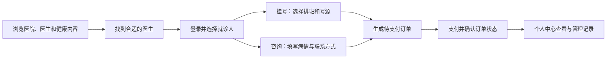

# 项目模块详解：从认识项目到讲清功能

> 面向第一次接触项目的同学、演示者和接手开发者。先理解用户如何使用，再按需要深入代码。
>
> **只想快速了解**：看第一节。**准备功能演示**：看第二、三、四节，再用第六节的讲解脚本。**准备技术问答或接手开发**：看第五节和文末的源码导航。
>
> 本文依据当前前后端源码整理；“页面已接接口”表示代码中存在调用，不代表当前环境已经联调成功。启动步骤见 [启动指南](启动指南.md)，支付宝联调见 [沙箱接入说明](docs/alipay-sandbox.md)。

## 一、先用两分钟认识项目

### 这个系统解决什么问题

这是一个面向普通用户的**在线医疗预约平台**：用户可以查医院、找医生，选择线下就诊的挂号服务，或者提交电话咨询订单，并管理自己的预约记录和家人的就诊资料。

用一句话向别人介绍：

> “我们把找医生、选服务、提交预约、支付和查看记录放到了一套系统里。用户既可以给自己预约，也可以替家人预约；挂号与电话咨询是两条主要业务线。”

当前仓库包含用户端页面和一个后端服务。电话咨询主要覆盖预约与订单管理，尚未看到实际拨号、音视频通信或医生接诊工作台；不要把它介绍成已经具备完整远程诊疗能力的平台。

### 跟着用户的目的认识模块



| 用户此时想做什么 | 对应能力 | 这一部分最需要讲清楚的区别 |
|---|---|---|
| “这家医院怎么样，这位医生看什么病？” | 医院、科室、医生、疾病、文章 | 医院和科室帮助筛选，医生是服务入口，排班决定能否挂号 |
| “我已经有关键词，怎么快速找到？” | 分类搜索、热搜、搜索历史 | 搜索负责定位资源，选中结果后进入同一套详情页 |
| “我要替家人预约，订单算谁的？” | 登录、账号资料、就诊人档案 | 登录账号是操作者，就诊人是实际接受服务的人 |
| “我要去医院看诊” | 挂号订单 | 预约的是某个医生在某天、某个时段的有限号源 |
| “我想先提交电话咨询” | 咨询订单 | 记录咨询对象、病情与联系信息，当前不扣挂号库存 |
| “钱付了吗，还能取消吗？” | 支付、退款、订单状态、超时取消 | 下单和支付是两个步骤，操作是否允许取决于订单状态 |
| “下次还想找这位医生” | 关注、评价、消息、反馈 | 关注帮助再次查找，评价关联订单，消息说明业务结果 |

### 先分清四个容易混淆的对象

- **账号与就诊人**：小李登录自己的账号，也可以选择母亲的档案预约。订单归小李管理，订单中的患者信息是母亲的信息。
- **医生与排班**：医生介绍“谁提供服务”；排班说明“哪天、哪个时段、在哪家医院、还有几个号”。挂号下单传的是排班 ID。
- **订单与支付流水**：订单记录“买了什么服务”；支付流水记录“这笔钱处理到哪一步”。待支付订单已经存在，但不能据此判断付款成功。
- **疾病与文章**：疾病页用于查询结构化的疾病信息，文章页用于阅读健康科普；二者都属于浏览内容，不直接产生订单。

## 二、用一次替家人挂号，串起主要功能

设想这样一个场景：**小李想替母亲预约一位医生。** 讲解时沿着下面的页面走，听众能同时理解功能和模块之间的关系。

### 第一步：从医院或搜索结果找到医生

有两种入口，最终都会落到医生详情：

| 入口 | 页面路径 | 适合怎样的用户 |
|---|---|---|
| 按医院逐步浏览 | 首页 → 医院列表 → 医院详情 → 医生详情 | 已经选好了医院，想继续找科室和医生 |
| 按关键词查找 | 搜索页 → 医生或医院搜索结果 → 对应详情 | 已经知道医生名、医院名或相关关键词 |

在医生详情页，重点展示医生介绍、所属医院和科室、价格、排班与患者评价。这里完成的是**选择服务提供者**，还没有创建订单。

医院、医生、科室、疾病、文章和公开搜索接口允许游客浏览。登录后还可以关注医院、医生或疾病，在个人中心再次找到它们。

**这一屏可以这样讲：**“平台先帮助用户决定找谁看诊。医生详情把介绍、价格和排班放在一起，用户从这里继续选择挂号或电话咨询。”

### 第二步：登录，并确认“谁去看病”

小李登录后，在“就诊人管理”中维护母亲的姓名、手机号等资料，再到预约页面选择这个档案。一个账号可以维护多个就诊人；默认就诊人方便常用选择。

后端接到 `familyMemberId` 后，会检查档案是否属于当前登录账号，再把患者信息复制到订单中。挂号会保存姓名、电话、身份证、性别和年龄等信息；咨询主要取姓名和电话。

这样做有两个直接结果：下单时减少重复填写；订单保存下单当时的患者信息，后续编辑档案不会直接改写历史订单。

> 演示持久化档案时，从“就诊人管理”页新增，再回到预约页选择。预约表单中的临时新增就诊人只加入当前页面列表，不能据此说明档案已经保存到个人中心。

### 第三步：选中排班，创建挂号订单

进入 `reservation.html` 后，选一个仍有余号的日期与时段，再选就诊人并提交。页面会调用 `POST /api/appointments`，成功后进入挂号支付页。

此时后端完成四件事：

1. 检查排班存在、日期未过期、号源可用，并确认医生存在。
2. 通过 Redis 预扣一个号源，再通过数据库的条件更新扣减剩余数量。
3. 读取医生的挂号价格，保存就诊信息，生成以 `GH` 开头的待支付订单。
4. 尝试写入下单通知，提示用户在支付时限内付款。

**这一步最值得停下来解释：号源在下单时就占用，而不是付款后才占用。** 因此系统必须处理取消和超时释放，否则未付款的订单会一直占着号。

订单金额由后端读取医生价格，前端不能通过提交一个更小的金额改变应付费用。

### 第四步：付款，确认订单确实变成“已支付”

支付页先按订单 ID 读取订单，再用订单号发起支付。当前前后端只展示并支持支付宝，接入目标为支付宝沙箱。

付款过程中有三个不同节点，讲解时要分开：

| 节点 | 能说明什么 | 还不能说明什么 |
|---|---|---|
| 进入支付页 | 待支付订单已创建，可以看到应付金额 | 用户已经付款 |
| 获得支付宝表单并跳转 | 后端已发起支付流程 | 支付成功且本地已入账 |
| 后端确认支付结果并更新订单 | 订单与支付流水进入相应状态 | 不能只用前端“成功”标题替代这个检查 |

正常支付由支付宝异步通知或服务端查单确认。浏览器返回接口也要先验签，再向支付宝查单；它不直接凭浏览器携带的状态把订单改成已支付。

**这一屏可以这样讲：**“下单成功只代表预约单建立了。系统要确认支付宝的支付结果后，才会把预约单更新为已支付。”

### 第五步：在个人中心查看订单，解释后续分支

“我的挂号”展示当前账号的订单、就诊时间、患者和状态，也接入了取消接口。后端按订单归属限制查询和操作，用户不能用别人的订单 ID 管理对方的订单。

| 订单现在是什么状态 | 用户或系统执行什么 | 后端如何处理 |
|---|---|---|
| 待支付 | 用户取消 | 取消订单，释放号源 |
| 待支付且超过时限 | 定时任务扫描 | 取消订单，释放号源，写入超时通知 |
| 已支付 | 用户取消 | 先走退款处理，再取消订单并释放号源 |
| 已支付 | 调用完成接口 | 改为已完成，增加医生接诊数并清理医生详情缓存 |
| 已完成或已取消 | 再次取消 | 拒绝不允许的状态变更 |

默认支付时限为 **15 分钟**，扫描任务默认在每次执行结束后等待 **60 秒**再执行；实际取消发生在扫描处理时，不是精确到第 15 分钟的倒计时事件。

“我的挂号”会在已支付订单上显示“完成就诊”，操作成功后订单变为已完成并出现评价入口。演示时可以从已支付状态继续完成订单，再提交评价并到“我的评价”确认结果。

## 三、电话咨询应该怎么讲：突出与挂号的区别

讲完挂号后，电话咨询不必重新重复登录、支付、退款的整套过程。回到医生详情，点击电话咨询，展示咨询表单，再解释下面四个区别即可。

| 对比点 | 预约挂号 | 电话咨询 |
|---|---|---|
| 用户预约什么 | 某个排班对应的线下就诊号源 | 向指定医生提交咨询订单 |
| 下单的核心输入 | 排班 ID、就诊人、病情描述 | 医生 ID、咨询人、病情描述等 |
| 费用从哪里取 | 医生的 `registrationPrice` | 医生的 `price`，当前不是按填写时长计算费用 |
| 是否占号 | 是，下单扣号，取消或超时释放 | 否，当前没有咨询名额或时段容量扣减 |
| 订单标识与记录 | `GH` 前缀，保存在 `t_appointment` | `ZX` 前缀，保存在 `t_consult` |
| 后续状态 | 待支付、已支付、已完成、已取消 | 另有“咨询中”状态定义 |

**可直接使用的讲解词：**

> “挂号解决的是去医院的预约，必须选中排班并占用号源；电话咨询解决的是提交远程咨询需求，所以更关注病情和联系方式。两类订单共用支付服务，但保留各自的订单数据和状态规则。”

咨询表单目前提交医生、患者、病情和 30 分钟时长等信息。后端还支持记录预约时间，但不要把页面中的所有展示项都当成已经完整提交到后端的数据。

当前实现支持从已支付或咨询中完成、取消咨询订单；尚未看到把订单推进到“咨询中”的独立接口，也未看到真实通话接入。因此，**可以演示咨询下单和订单管理，不能演示已经实现的在线接诊或自动拨号。**

## 四、其他功能各讲一个重点

### 资源浏览：用关系理解页面，不逐个背列表接口

医院提供组织入口，科室帮助分类，医生提供具体服务，排班把医生与日期、时段和可用号源连起来。医院与科室通过关联表建立关系；科室自身又通过父级 ID 组成上下级结构。

疾病百科和健康文章补充信息浏览场景。文章详情会增加阅读量，因此不能把整个资源模块笼统地叫作“只读、不改数据”。

演示时看一组医院与医生详情，再选一篇文章即可。列表的筛选和翻页操作可以略过重复部分，把时间留给“如何从内容走到预约”。

### 搜索：解释如何找结果，以及找不到时发生什么

搜索覆盖医院、医生、疾病和文章四类内容。**ES 负责匹配和排序，MySQL 负责按命中的 ID 返回当前明细**；热搜和个人搜索历史保存在 Redis 中。

| 搜索遇到的情况 | 当前处理方式 |
|---|---|
| ES 查询正常 | 取命中的 ID，再回数据库组装结果并保留命中顺序 |
| ES 探测或查询失败 | 本次改用数据库模糊查询 |
| ES 被标记为不可用 | 暂时跳过 ES；超过 60 秒后，由后续搜索请求触发重新探测 |
| Redis 中的热搜或历史操作失败 | 捕获异常，主搜索仍可继续 |

个人历史最多保留 20 条、去重后把最近搜索放在前面，并设置 30 天有效期。热搜展示累计热度较高的词，个人历史展示这个账号最近搜过的词，二者不要混讲。

索引目前通过接口全量写入数据库中的资源，没有实时变更同步。回数据库能取得命中对象的当前明细，但不能解决旧索引漏搜新内容、排序过时等问题；当前“重建”实现也没有先清空旧索引，不能当作完整的数据同步机制。

### 个人中心：按用户要办的事组织讲解

| 用户要办的事 | 页面或功能 | 讲解重点 |
|---|---|---|
| 再次找到关注过的对象 | 我的医院、医生、疾病关注 | 一张关注表用类型区分三类对象，支持关注和取消关注 |
| 给家人预约 | 就诊人管理 | 档案归账号所有，常用资料复用到订单；支持设置默认成员 |
| 知道订单发生了什么 | 我的消息 | 下单、支付、退款、超时取消等业务会尝试写入站内通知 |
| 管理账号 | 个人资料、修改密码 | 修改资料与登录凭证分开；改密码需要验证旧密码 |
| 向平台提意见 | 意见反馈 | 支持提交和查看自己的反馈；回复、处理状态是预留数据，未见管理端处理页面 |
| 查看或提交服务评价 | 我的评价、医生评价列表、订单页评价弹窗 | 评价提交会携带订单、评分和内容写入后端，并在刷新后回读已评价状态 |

**评价是讲解时最需要区分前后端完成度的功能。** 后端 `POST /api/reviews` 会检查订单归属和状态，从订单确定医生，并检查重复评价；保存后重算医生平均分、清理详情缓存。允许的正常状态包括已支付、已完成，以及咨询中的订单，不限于已完成订单。

`my-appointment.html` 和 `my-consult.html` 会调用该接口提交评分与内容，并通过“我的评价”回读订单是否已评价。演示这一步需要一笔满足后端评价状态要求、且尚未评价的订单。

## 五、理解实现：围绕三个问题深入

### 1. 系统怎么知道当前是谁，为什么退出后令牌会失效？

注册时，系统校验短信验证码，把密码经 BCrypt 哈希后保存。登录验证通过后，签发 JWT，并把令牌写入 Redis；后续受保护的请求同时检查 JWT 和 Redis 中的令牌记录。

```text
手机号和密码 → 验证账号 → 返回 JWT，并登记到 Redis
带令牌请求   → 验 JWT + 查 Redis → 将 userId 放入请求线程上下文
业务操作     → 读取当前 userId → 校验订单、档案等资源归属
退出登录     → 删除 Redis 令牌记录 → 后续请求无法继续使用该令牌
```

这样既能识别用户，也能让退出登录立即生效。请求结束时会清理用户上下文，避免线程复用时遗留身份。

公开浏览由白名单放行；订单、档案等功能需要登录。需要注意，**登录校验并不等于管理员权限**：当前搜索索引写入接口受登录保护，但没有单独的管理员角色检查。

### 2. 最后一个号，如何避免两个订单都扣成功？

难点在于：多个请求可能同时看到“还剩 1 个号”。如果只是先查询、再无条件减一，查询结果就不足以保证库存正确。

当前下单使用两层扣减：

- **Redis 预扣**：Lua 脚本把“判断还有没有号”和“减一”放在一次原子执行中，提前拦截库存不足的请求。
- **数据库兜底**：更新语句包含 `remain_count > 0` 条件，根据实际影响行数判断是否扣到号。数据库扣减与订单写入处在本地事务中。

如果 Redis 预扣成功、数据库条件更新未扣到号，代码会回补 Redis 并拒绝下单。取消或超时则根据订单中的医生、医院、日期和时段定位排班，再回补号源。

这里可以讲“数据库条件更新兜底、防止库存被无限扣成负数”，但不要扩展成“Redis 与数据库始终强一致”。当前实现没有覆盖所有异常后的 Redis 补偿：例如预扣后就诊人校验或订单写入失败，数据库可以回滚，Redis 预扣不随数据库事务自动回滚；也未见持续校准库存的任务。

### 3. 怎么确认钱真的付了，并处理重复或晚到的通知？

两类业务共用 `PaymentService`，通过业务类型和订单号找到对应订单。支付前检查归属、状态和金额；业务订单与支付流水共同记录处理进度。

| 情况 | 当前代码里的处理 |
|---|---|
| 支付宝发来异步通知 | 校验签名、应用标识和卖家标识，识别支付状态 |
| 通知声明付款成功 | 核对通知金额、订单金额、支付流水金额 |
| 浏览器从支付宝返回 | 验签后由服务端查单，再走支付结果处理 |
| 同一成功通知重复到达 | 检查流水状态和第三方交易号，避免重复推进订单和发送成功通知 |
| 订单已取消后才确认付款 | 尝试退款，成功后把流水标记为已退款，保持订单取消状态 |
| 已支付订单主动取消 | 校验订单与流水金额，调用退款后再推进本地取消流程 |

订单和流水查询使用数据库行锁来串行处理冲突操作。不过支付宝调用是外部请求，不会随本地数据库事务一起回滚；当前有退款调用和部分重试路径，不能据此宣称已具备完整的自动对账与补偿系统。

### 各项技术具体承担什么

前端是静态 HTML 页面，使用 Vue 和 Axios 组织交互；后端是 JDK 21、Spring Boot 3 的单体应用，持久层使用 MyBatis-Plus。

```text
页面与 Axios
    ↓ 统一请求封装：令牌、业务结果、登录失效跳转
Controller：接收参数与校验
    ↓
Service：归属检查、业务规则、事务与第三方调用
    ↓
Mapper：查询和更新 MySQL
```

| 组件 | 在本项目中的用途 | 理解时保留的边界 |
|---|---|---|
| MySQL | 用户、资源、排班、订单、流水等持久化 | 业务数据的主要存储 |
| Redis | 登录令牌、验证码、详情缓存、库存预扣、热搜和历史 | 详情缓存能回源，不代表登录和库存路径也能在 Redis 故障时继续工作 |
| Elasticsearch | 四类资源的全文检索 | 失败可退到数据库查询，结果的检索效果可能不同 |
| 支付宝 | 支付、查单、退款 | 配置未启用时拒绝真实支付；模拟支付需要显式开启 |
| 短信服务 | 注册验证码发送 | 未就绪时使用日志桩；已启用服务的发送失败会报错 |
| OSS | 头像、反馈图片上传 | 未启用时不能完成上传，不能当作本地文件存储使用 |

统一返回格式为 `{code, message, data}`，分页数据包含列表和总数等字段。医院、医生详情通常缓存 30 分钟，缓存读写异常时可回数据库；这套公共机制集中理解一次即可。

## 六、一份可以照着操作的 10 分钟讲解脚本

演示前按 [启动指南](启动指南.md) 启动应用，准备一个可登录账号、一名就诊人，以及日期有效且有余号的医生排班。若要演示支付成功，先确认支付宝沙箱已可用；仅演示本地订单流转时，须明确模拟模式需要显式启用，模拟结果不能作为沙箱付款证据。

| 时间 | 打开或操作什么 | 这一步讲什么 | 用什么确认结果 |
|---|---|---|---|
| 0:00–1:00 | 首页，指明医院、医生和搜索入口 | 一句话介绍平台，说明挂号与咨询两条主线 | 听众能说出平台服务谁、能做什么 |
| 1:00–2:00 | 搜索一位医生，打开医生详情 | 搜索负责定位，详情负责帮助选择服务 | 页面中的医生、医院、价格与排班对应得上 |
| 2:00–3:00 | 登录，打开就诊人管理 | 登录账号和实际就诊人可以不同 | 保存后重新进入列表，能看到档案 |
| 3:00–5:00 | 回医生详情，选排班和就诊人，提交挂号 | 下单时占号，金额由后端确定 | 进入支付页，查到同一笔待支付订单 |
| 5:00–6:30 | 展示支付页；条件具备时完成沙箱付款 | 区分下单、发起支付、后端确认付款 | 返回订单列表或查询详情，确认后端状态；未启用支付时说明停留在待支付 |
| 6:30–7:30 | 打开我的挂号、我的消息 | 订单管理与通知如何衔接 | 核对同一订单及相关通知；准备另一笔待支付演示单时可取消并重新查看余号 |
| 7:30–8:30 | 回医生详情，打开电话咨询表单 | 用对比说明咨询不占挂号库存 | 展示患者与病情输入；若提交，查看生成的 ZX 订单 |
| 8:30–9:30 | 关注医生，再打开我的关注；查看评价 | 关注方便复访，评价与订单有关 | 关注和评价都应在刷新页面后回读确认，不能只看成功提示 |
| 9:30–10:00 | 回到流程图 | 回顾从找医生到管理订单的链路，点出库存与支付机制 | 将页面功能与背后规则对应起来 |

**演示取舍：** 超时取消用预先准备的超时订单、状态记录或代码说明，不需要现场空等 15 分钟。支付回调、库存并发、ES 故障恢复适合技术追问时再展开，不占用主流程的演示时间。

结束时可以这样讲：

> “用户从找医生出发，选就诊人和服务，生成订单后完成支付，再到个人中心管理记录。技术上，挂号重点解决有限号源的扣减与释放，支付重点解决结果确认和重复通知。电话咨询复用订单支付能力，保留自己的业务字段和状态。”

## 七、接手开发时，从哪里找实现

### 页面、接口与核心代码对照

以下是定位入口；完整参数与返回字段以运行中的 [Knife4j 接口文档](http://localhost:8080/doc.html) 和 DTO/VO 为准。

| 想了解的功能 | 页面入口 | 关键接口 | 主要实现 |
|---|---|---|---|
| 注册登录、退出 | `register.html`、`login.html` | `/api/auth/send-code`、`/register`、`/login`、`/logout` | [AuthService](src/main/java/com/hospital/service/AuthService.java)、[TokenInterceptor](src/main/java/com/hospital/interceptor/TokenInterceptor.java) |
| 医院与医生资源 | `hospital-detail.html`、`doctor-detail.html` | `/api/hospitals/{id}`、`/api/doctors/{id}`、`/api/doctors/{id}/schedules` | [HospitalService](src/main/java/com/hospital/service/HospitalService.java)、[DoctorService](src/main/java/com/hospital/service/DoctorService.java) |
| 疾病与健康文章 | `disease-detail.html`、`article-detail.html` | `/api/diseases/{id}`、`/api/articles/{id}` | [DiseaseService](src/main/java/com/hospital/service/DiseaseService.java)、[ArticleService](src/main/java/com/hospital/service/ArticleService.java) |
| 挂号下单与管理 | `reservation.html`、`my-appointment.html` | `/api/appointments`、`/{id}/cancel`、`/{id}/complete` | [AppointmentService](src/main/java/com/hospital/service/AppointmentService.java)、[StockService](src/main/java/com/hospital/service/StockService.java)、[ScheduleMapper](src/main/java/com/hospital/mapper/ScheduleMapper.java) |
| 咨询下单与管理 | `phone-consult.html`、`my-consult.html` | `/api/consults`、`/{id}/cancel`、`/{id}/complete` | [ConsultService](src/main/java/com/hospital/service/ConsultService.java) |
| 支付与退款 | `reservation-pay.html`、`consult-pay.html` | `/api/pay/create`、`/query`、`/alipay/notify`、`/alipay/return` | [PaymentService](src/main/java/com/hospital/service/PaymentService.java)、[AlipayService](src/main/java/com/hospital/third/pay/AlipayService.java) |
| 超时取消 | 无独立页面 | 定时任务调用订单服务 | [OrderTimeoutTask](src/main/java/com/hospital/task/OrderTimeoutTask.java) |
| 搜索与历史 | `search.html` 及分类搜索页 | `/api/search/hospitals`、`/doctors`、`/diseases`、`/articles`、`/hot`、`/history`、`/reindex` | [SearchService](src/main/java/com/hospital/service/SearchService.java)、[SearchHistoryService](src/main/java/com/hospital/service/SearchHistoryService.java) |
| 就诊人档案 | `family-members.html` | `/api/family-members`、`/{id}/default` | [FamilyMemberService](src/main/java/com/hospital/service/FamilyMemberService.java) |
| 关注和评价 | `follow-*.html`、`my-reviews.html`、订单页评价弹窗 | `/api/follows`、`/api/reviews`、`/api/reviews/mine`、`/api/reviews/doctor/{doctorId}` | [FollowService](src/main/java/com/hospital/service/FollowService.java)、[ReviewService](src/main/java/com/hospital/service/ReviewService.java) |
| 消息和反馈 | `my-messages.html`、`my-feedback.html` | `/api/messages`、`/api/feedbacks` | [MessageService](src/main/java/com/hospital/service/MessageService.java)、[NotificationService](src/main/java/com/hospital/service/NotificationService.java)、[FeedbackService](src/main/java/com/hospital/service/FeedbackService.java) |
| 资料与上传 | `personal-info.html`、`change-password.html` | `/api/user/profile`、`/api/user/password`、`/api/files/upload` | [UserService](src/main/java/com/hospital/service/UserService.java)、[FileController](src/main/java/com/hospital/controller/FileController.java) |

页面位于同级的 `../hospital/` 目录。表中共享前缀的接口省略了重复前缀；具体请求方法见对应 Controller。公共入口可从 [WebMvcConfig](src/main/java/com/hospital/config/WebMvcConfig.java)、[前端请求封装](../hospital/js/auth-interceptor.js) 和 [CacheService](src/main/java/com/hospital/service/CacheService.java) 开始读。

### 按业务关系认识 17 张表

| 数据组 | 表 | 与其他部分的连接 |
|---|---|---|
| 谁在操作、谁来就诊 | `t_user`、`t_family_member` | 用户拥有档案和订单，订单复制患者信息 |
| 去哪里、找谁、有没有号 | `t_hospital`、`t_department`、`t_hospital_department`、`t_doctor`、`t_schedule` | 医院关联科室，医生和排班把浏览入口接到挂号 |
| 看哪些内容 | `t_disease`、`t_article` | 支持分类浏览、详情阅读和搜索 |
| 预约了什么、钱到哪一步 | `t_appointment`、`t_consult`、`t_payment_flow` | 两类订单用业务类型与订单号关联支付流水 |
| 后续关系与反馈 | `t_follow`、`t_review`、`t_message`、`t_feedback` | 关注关联资源，评价关联订单和医生，消息与反馈归用户 |
| 系统预留 | `t_config` | 配置 KV 表，不能据此推断已有配置管理后台 |

建表内容见 [hospital_full.sql](src/main/resources/db/hospital_full.sql)。文件存在不代表应用启动时会自动导入；当前源码未见自动执行该脚本的初始化配置。
